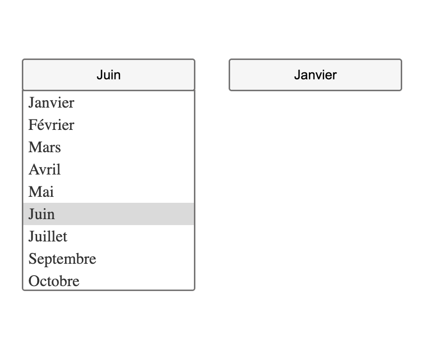

## react-menu-dropdown-list

`React-Menu-Select-List` est un composant React qui offre une liste déroulante de sélection d'options avec prise en charge de l'accessibilité au clavier.



### Installation

npm install react-menu-dropdown-list

### Use

import {MenuSelect} from "react-menu-dropdown-list"

```jsx
<MenuSelect
  options={[]}
  onSelect={() => {}}
  classNameContainer=""
  classNameButton=""
  classNameList=""
  classNameItem=""
/>
```

### Props

- `options` (Array): Tableau d'options à afficher dans la liste déroulante.
- `onSelect` (Function): Fonction de rappel appelée lorsqu'une option est sélectionnée.
- `classNameContainer` (String): Classe CSS pour le conteneur principal du menu.
- `classNameButton` (String): Classe CSS pour le bouton de bascule du menu.
- `classNameList` (String): Classe CSS pour la liste des options.
- `classNameItem` (String): Classe CSS pour chaque élément dans la liste des options.

## Fonctionnalités

- Navigation au clavier pour parcourir les options.
- Prise en charge de la sélection des options à l'aide de la souris ou du clavier.
